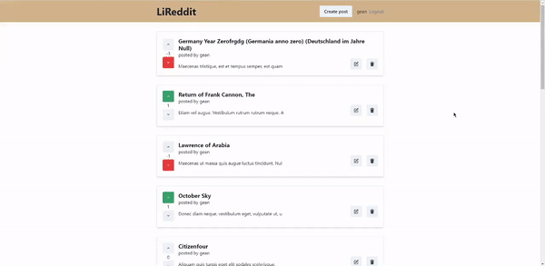

# Reddit Web
      

  

* [Content (en-US)](#secao-en_us)
* [Conteúdo (pt-BR)](#secao-pt_br)

---

## About the project 

This is a NextJS app based on the main functionalities of Reddit's site.
In the app, users can create an account, login, change account password through recovery email, create a post, see all the posts, edit a post, delete a post, and upvote and downvote posts. Each users are able to see its own upvotes and downvotes in a post, and delete and update only its own posts.

The app was created using NextJS, with Server-Side Rendering in some pages. The connection with the server was made using the Apollo GraphQL Client. The layout was created using Chakra UI components, and the forms were created with Formik to better handle input data.

The app's server repository can be found [here](https://github.com/legeannd/reddit-server).

## Content
  * [Techs](#techs)
  * [How to run the project](#installation)

## Techs 

- [x] ReactJS
- [x] NextJS
- [x] GraphQL
- [x] Apollo Client
- [x] Formik
- [x] Chakra UI

## How to run the project 
To run the project, you'll need to have Node and NPM or Yarn installed to setup all the dependencies.

Install all dependencies using the `yarn` command, and run `yarn dev` to open the project page on `localhost:3000`.

---

## Sobre o projeto 

Este é um aplicativo NextJS baseado nas funcionalidades principais do site do Reddit. No app, os usuários podem criar uma conta, fazer login, mudar a senha da conta através do email, criar um post, ver todos os posts, editar um post, deletar um post, e dar upvote e downvote nos posts. Todos os usuários podem ver seus próprios upvotes e downvotes em um post, e deletar e atualizar apenas seus próprios posts.

O app foi criado utilizando NextJS, com Server-Side Rendering em algumas páginas. A conexão com o servidor foi feita utilizando o Apollo GraphQL Client. O layout foi criado com os componentes do Chakra UI, e os formulários foram criados com Formik para uma manipulação melhor dos dados de input.

O repositório do servidor do app pode ser encontrado [aqui](https://github.com/legeannd/reddit-server).

## Conteúdos
  * [Tecnologias](#tecnlogias)
  * [Como executar o projeto](#instalacao)

## Techs 

- [x] ReactJS
- [x] NextJS
- [x] GraphQL
- [x] Apollo Client
- [x] Formik
- [x] Chakra UI

## Como executar o projeto 
Para executar o projeto, você irá precisar ter o Node e o NPM ou Yarn instalados para baixar as dependências.

Instale todas as dependencias utilizando o comando `yarn`, e rode o comando `yarn dev` para abrir o a página do projeto em `localhost:3000`

---
###### Developed by [Gean Lucas](https://www.linkedin.com/in/geanlucaas/) :rocket:.
